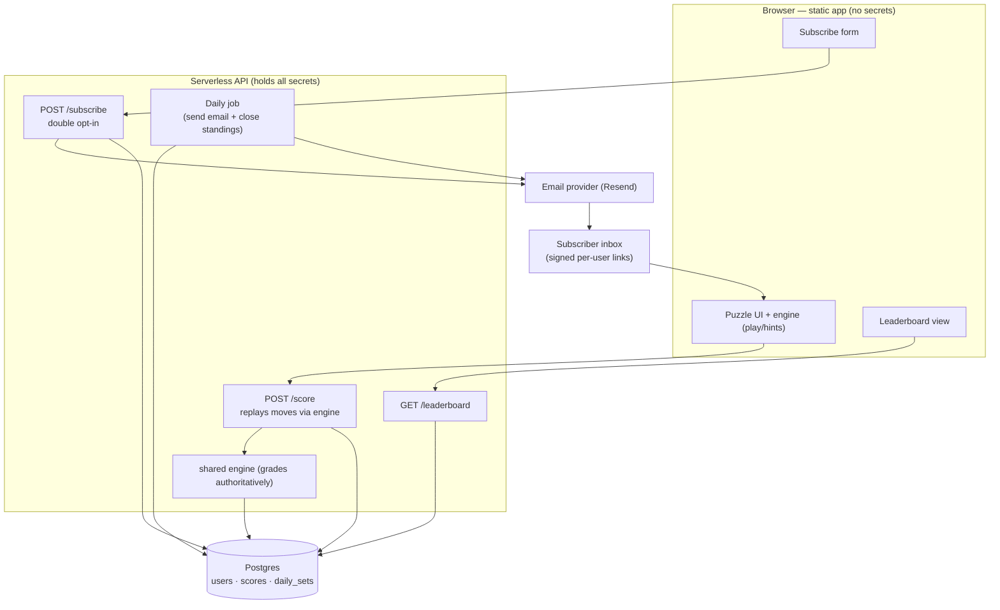

# Multi-user architecture: subscriptions + leaderboard

How to evolve Tabletop Trainer from a static single-recipient daily email into a
multi-user product where anyone can subscribe and compete on a leaderboard.

## Where we are today

- **Frontend:** static React app on GitHub Pages, no backend.
- **Engine:** pure, deterministic TypeScript — a seed fully determines the board,
  opponents, and the correct grades.
- **Email:** one GitHub Action + Gmail SMTP to a single hard-coded recipient.
- **State:** none. Nothing is stored between visits.

Multi-user needs four things we don't have yet: a **datastore**, a **backend API**,
**identity/auth**, and **email at scale**.

## The key insight: determinism gives us anti-cheat for free

Because the engine is deterministic, the **server can recompute everything**. The
client must therefore submit the **moves a player made** (their settlement/road
choices), never a self-reported score. The server replays those moves through the
same engine and computes the authoritative points. A player cannot inflate their
score without submitting a sequence of moves that actually earns it, and the
"best" answer is known server-side. This is why the engine must be packaged so it
runs both in the browser and on the server (it already can — it's pure TS with no
DOM or I/O).

## Recommended stack

Optimised for "friends + enthusiasts" scale (tens–low thousands), near-zero cost,
low ops, and keeping the existing static frontend.

| Concern | Recommendation | Why |
|---|---|---|
| Database | **Postgres (Supabase)** | Relational fits leaderboard queries; email as natural key; free tier |
| Backend API | **Supabase Edge Functions** (or Vercel/Cloudflare Workers) | Run the shared engine server-side for grading; hold all secrets |
| Auth / identity | **Passwordless email** (magic link) + **signed per-day links** | "Email is identity" with no passwords; low-friction play-from-email |
| Transactional email | **Resend** (or Postmark/SES) | Real deliverability, unsubscribe/bounce handling, batch send |
| Scheduler | Supabase scheduled function **or** the existing GitHub Action cron | Daily send + daily leaderboard close |
| Frontend | Unchanged (GitHub Pages) | Talks to the API; still ships zero secrets |

**Alternative** if you prefer to stay GitHub/Cloudflare-native: Cloudflare Workers
+ D1 (SQLite) + Email Workers. Slightly more wiring, same shape. Supabase gets you
to a working product fastest because auth + DB + functions are one service.

> The engine should be extracted into a small shared package (e.g. `packages/engine`)
> imported by both the web app and the server functions, so grading logic exists in
> exactly one place.

## System architecture



## Data model (email as the primary key, as requested)

```sql
-- Natural key = email. See note below on the tradeoff.
create table users (
  email             text primary key,
  display_name      text not null,
  subscribed        boolean not null default true,
  confirmed_at      timestamptz,                       -- set on double opt-in
  unsubscribe_token uuid not null default gen_random_uuid(),
  created_at        timestamptz not null default now()
);

-- Seeds derive from the date, but we store them for history + integrity.
create table daily_sets (
  puzzle_date date primary key,
  seeds       text[] not null                          -- the day's 5 seeds
);

-- One row per user per individual puzzle. First submission is authoritative.
create table scores (
  email        text    not null references users(email) on delete cascade,
  puzzle_date  date    not null,
  puzzle_index smallint not null check (puzzle_index between 1 and 5),
  moves        jsonb   not null,     -- the settlement/road choices submitted
  points       integer not null,     -- server-computed by replaying `moves`
  grade        text    not null,     -- S..D summary
  breakdown    jsonb   not null,     -- per-decision coach detail
  submitted_at timestamptz not null default now(),
  primary key (email, puzzle_date, puzzle_index)
);
create index on scores (puzzle_date, points desc);
```

**Leaderboard** is just aggregation over `scores`:

```sql
-- Daily leaderboard: total across the day's 5 puzzles.
select u.display_name, sum(s.points) as total
from scores s join users u on u.email = s.email
where s.puzzle_date = current_date
group by u.email, u.display_name
order by total desc
limit 100;
```

Weekly / all-time are the same query over a date range. Never expose `email` on the
public board — show `display_name` only.

> **Note on email-as-PK (honouring your choice):** a natural email key is perfectly
> fine at this scale. The standard production alternative is a surrogate `id uuid`
> primary key with `email` as a `unique` column, which is cleaner if you ever let
> users *change* their email (a natural PK would cascade that change through every
> table). Easy to migrate later; email PK is a fine place to start.

## Identity & login (passwordless, email-centric)

Two complementary mechanisms, no passwords:

1. **Signed per-day links in the email.** Each subscriber's daily email links carry
   a short-lived signed token: `…/tabletop-trainer/?seed=<seed>&t=<jwt>` where the
   JWT encodes `{ email, date }`, signed with a server secret. Clicking from their
   inbox authenticates them to submit that day's scores — zero friction.
2. **Magic-link login** for visiting the site directly (leaderboard, profile):
   enter email → receive a one-time link → session. Supabase Auth does this
   out of the box.

The server verifies the token/session on every `POST /score`, so a score is always
tied to a **verified** email — nobody can submit under someone else's identity.

## Daily email at scale

Gmail SMTP via a GitHub Action does **not** scale (per-account send caps, no
unsubscribe/bounce handling, deliverability risk). Move to a provider:

- **Double opt-in:** signup stores the user unconfirmed and sends a confirm link;
  `confirmed_at` is set when they click. Only confirmed users receive the daily.
- **Daily job:** query confirmed subscribers, generate each one's signed links,
  batch-send via the provider.
- **Compliance (required for real email):** one-click unsubscribe using
  `unsubscribe_token`, a `List-Unsubscribe` header, and a physical mailing address
  in the footer (CAN-SPAM). Honour unsubscribes immediately (flip `subscribed`).

## Score submission & fairness

- Client submits the **move sequence**; server replays it to grade → writes one
  `scores` row. Reject the second submission for a `(email, puzzle_date,
  puzzle_index)` so the leaderboard reflects one honest attempt.
- To discourage "retry until perfect," withhold the coach's *best-spot overlay*
  until after the score is submitted (play first, learn after). Fine to keep
  live hints off for a "ranked" mode.
- Rate-limit `/subscribe` and `/score`; add a captcha on signup if abused.

## Security & privacy

- Secrets (DB URL, email API key, JWT signing key) live **only** in serverless env
  — the browser bundle stays secret-free, exactly as today.
- Postgres row-level security: a user can write only their own `scores` row.
- PII: emails are personal data. Get consent (double opt-in), provide unsubscribe
  and deletion on request, and never render emails publicly. If you'll have EU
  users, this is GDPR territory — display names on the board, emails private.

## Phased delivery plan

1. **Extract the engine** into a shared package importable by web + server. No
   behaviour change; add a server entry that grades a submitted move sequence.
2. **Stand up Supabase**: create the tables above; add a subscribe form + the
   double-opt-in confirm flow. (Daily email still via the current job for now.)
3. **Move email to Resend**: daily job queries confirmed subscribers, sends signed
   per-user links, adds unsubscribe. Retire the Gmail SMTP path.
4. **Scores + leaderboard**: `POST /score` (replay-grade, first-attempt-wins) and a
   leaderboard page (daily / weekly / all-time).
5. **Polish**: profiles/display names, streaks, shareable result cards, anti-cheat
   hardening, admin view.

## Cost at friend scale

Effectively $0: Supabase free tier (DB + auth + functions), Resend free tier
(~3k emails/month), GitHub Pages (frontend) free. Costs only appear at real scale.

## Open decisions (your call — I have a default for each)

- **Platform:** Supabase (recommended) vs Cloudflare vs Vercel+Neon.
- **Ranked strictness:** hints/best-overlay off during a scored attempt? (default: off)
- **Scope of "daily":** rank each of the 5 puzzles, or only puzzle #1 ranked and
  2–5 for practice? (default: sum all 5)
